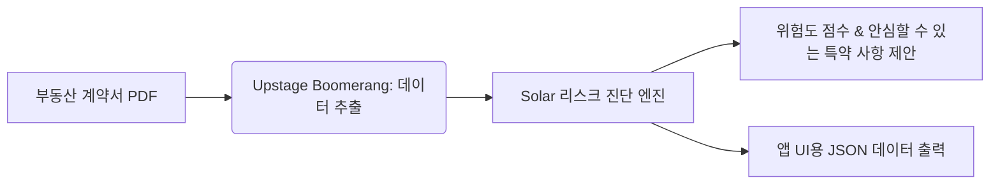

# 🏠 Solar 전세 사기 지킴이

> **Upstage Solar LLM을 활용한 지능형 전세 계약 리스크 진단 시스템**

이 프로젝트는 Upstage의 Product Usecase인 부동산 문서 정보 추출 서비스 **'Boomerang'**을 벤치마킹하여, PM의 관점에서 비즈니스 가치를 더해 고도화하였습니다. Document(계약서, 등기 등)의 데이터를 추출하는 기존 기능에 Solar LLM의 추론 능력을 결합하여 사용자에게 **실질적인 의사결정 가이드**를 제공하는 전세사기 진단 엔진을 설계했습니다.

---

## 1. 프로젝트 개요

### 1.1. 배경 및 문제 정의
- **기존 OCR/추출 모델의 한계**: Upstage `information-extract` API(부메랑 기반)는 계약서와 등본 내 핵심 데이터(수치, 텍스트)를 정확히 뽑아내지만, 부동산 법률 지식이 부족한 일반 사용자는 이 데이터가 의미하는 것이 무엇인지, 그래서 이 계약이 위험한지 아닌지 판단하기 어려운 한계가 있습니다.
- **정보의 비대칭성**: 임대인과 임차인 사이의 정보 격차로 인해, 임차인은 자신에게 불리한 독소 조항을 인지하지 못한 채 계약을 체결하여 보증금 미반환 리스크에 노출됩니다.

### 1.2. 해결 방법
- **추출에서 추론까지**: 부메랑의 데이터 추출 결과를 Solar LLM의 추론 엔진에 통과시켴 **'데이터 나열'에서 '법률적 인사이트'**로 가치를 전환합니다.
- **바로 실행할 수 있는 현실적인 가이드 제공**: 위험 요소를 단순히 경고하는 것에 그치지 않고, 사용자가 즉시 계약서에 반영할 수 있는 **'안심 특약 수정안'**을 제안하여 실질적인 문제 해결을 돕습니다.

---

## 2. 시스템 아키텍처 및 개선 사항

本 프로젝트는 부메랑의 API 호출 구조를 계승하되, Solar LLM 기반의 **'진단 및 정형화 레이어'**를 새롭게 추가하여 파이프라인을 확장했습니다.



---
### 2.1. 기능 비교 및 개선 사항
| 평가 항목 | 기존 (부메랑) | 개선 (전세지킴이) |
| :--- | :--- | :--- |
| **주요 기능** | 핵심 데이터 추출 및 나열 | **추출 데이터 기반 리스크 자동 진단** |
| **제공 가치** | 정보 전달 | **의사결정 지원** |
| **출력 형태** | 단순 JSON | **진단 점수 및 액션 플랜 포함 JSON** |
| **특약 분석** | 텍스트 추출 | **독소 조항 감지 및 수정안 제안** |


---

## 3. PM으로서 로직 설계해보기

AI가 일관성 있는 전문 답변을 내놓을 수 있도록 아래와 같은 정형 데이터 스키마와 판단 로직을 설계했습니다.

### 3.1. 진단 엔진 출력 데이터 구조 (JSON)
사용자 UI에 바로 연동할 수 있도록 다음과 같이 데이터 구조를 표준화했습니다.

```json
{
  "risk_summary": "전세권 미등기 및 보증보험 미등록에 따른 법적 보호 장치 부재로 위험도 High 진단.",
  "diagnosis_items": [
    {
      "item": "전세권 등기 여부",
      "risk_level": "High",
      "reason": "권리개수 0건으로 확인되며, 현재 전세권 미등기로 인해 제3자에 대한 대항력 확보가 시급함."
    }
    // ... 이하 생략 (스키마 구조 일치화)
  ],
  "action_plan": [
    "임대인에게 전세권 설정 및 등기 요청",
    "전세보증금 반환보증 가입 여부 확인 및 요구"
  ],
  "special_clauses": [
    {
      "clause_name": "전세권 설정 및 대항력 확보 의무",
      "clause_text": "임대인은 계약 체결 후 30일 이내에 전세권 설정을 완료하고 증명서를 제공한다.",
      "legal_basis": "민법 제303조 및 주택임대차보호법 제3조"
    }
  ]
}
```

---


## 4. 기술 검증 결과


### 4.1. 입력한 프롬프트

```
# Role
 - 대한민국 부동산 법률 및 전세사기 방지 전문 AI 서비스 엔진
# Context
 - 사용자가 업로드한 부동산 문서(등기부등본, 계약서)의 추출 데이터를 기반으로 치명적인 리스크를 찾아내고 솔루션을 제공함.


# Input Data (Boomerang Extraction):

{
  "등기부등본": { "발급일": "2025-09-30", "권리개수": 0 },
  "건축물대장": { "주용도": "다세대주택", "층수": "4층" },
  "계약서": { "보증금": "150,000,000", "임대기간": "2025-11-28 ~ 2026-11-27" }
}


# Current Date
 - 2026-03-12 (현 시점 기준 분석 필수)

# Task
1. 리스크 정밀 진단: 입력된 데이터 간의 논리적 모순과 법적 허점을 분석하라. (특히 발급일의 최신성, 대항력 공백, 임대차 보호법 적용 여부 중심)
2. 안심 특약 설계: 임차인을 완벽히 보호할 수 있는 법적 효력이 있는 특약 문구 2개를 제안하라.
3. 데이터 정형화: 위 분석 내용을 실제 앱 서비스 UI에 렌더링할 수 있도록 규격화된 JSON 포맷으로 요약하라.

# Output Format
1. [리스크 총평]: 전문가의 시선으로 본 현재 계약의 위험도 요약
2. [세부 진단 항목]: 항목별 위험도(High/Medium/Low)와 구체적 사유
3. [전문가 처방전]: 임차인이 당장 실행해야 할 Action Plan
4. [시스템 연동용 JSON]: (반드시 포함)
```


### 4.1.2. Solar 답변


### 4.2. Solar가 제공한 시스템 연동용 JSON
```json
{
  "risk_summary": "전세권이 등기되지 않아 대항력 부재, 전세보증금 반환보증 미등록, 고액 보증금 및 계약 효력 검증 필요 등으로 현재 계약의 위험도는 ★★★★★(High)입니다.",
  "diagnosis_items": [
    {
      "item": "전세권 등기 여부",
      "risk_level": "High",
      "reason": "권리개수 0 → 전세권이 등기되지 않아 대항력 확보 불가. 임대인이 부동산을 매각·담보 설정 시 임차인 권리 소멸 위험."
    },
    {
      "item": "전세보증금 반환보증 등록 여부",
      "risk_level": "High",
      "reason": "반환보증기관에 등록되지 않아 보증금 반환 시 보증기관이 개입하지 않음. 사기·채무불이행 시 구제 어려움."
    },
    {
      "item": "계약서 서명일 확인",
      "risk_level": "Medium",
      "reason": "계약 체결일이 명시되지 않아 계약 효력·등기 시점 검증 필요. 계약일이 등기일보다 늦으면 무효 위험."
    },
    {
      "item": "보증금 규모·시장가 대비 적정성",
      "risk_level": "Medium",
      "reason": "1억5천만원은 고액 전세보증금. 보증료 한도·시장가 대비 과다 여부 확인 필요."
    },
    {
      "item": "건축물대장·등기부등본 일치 여부",
      "risk_level": "Low",
      "reason": "주용도·층수 일치(다세대주택·4층) → 큰 문제는 없으나, 호실·면적 등 상세 정보 누락."
    },
    {
      "item": "임대인·임차인 신원 확인",
      "risk_level": "Low",
      "reason": "등기부등본에 권리개수 0이므로 현재 소유자는 확인 가능하지만, 실제 계약 당사자 신원 검증 필요."
    }
  ],
  "action_plan": [
    "계약서 서명일 확인 및 계약 효력 검증",
    "임대인에게 전세권 설정·등기 요청 및 등기증명서 확보",
    "전세보증금 반환보증기관에 전세보증금을 등록하도록 요구 및 보증증명서 확보",
    "보증금 지급 영수증·계좌이체 내역 등 지급 증빙 확보",
    "임대인·보증기관·등기소 연락처 정리",
    "법무사·변호사 등 전문가 상담 후 최종 확인",
    "보증료 한도 초과 여부 확인 및 필요 시 보증기관 변경 논의",
    "임대인·임차인 신원 재확인(주민등록등본·사업자등록증 등)"
  ],
  "special_clauses": [
    {
      "clause_name": "전세보증금 반환보증 등록 및 보증료 납부 의무",
      "clause_text": "임대인은 본 계약 체결일로부터 30일 이내에 전세보증금을 반환보증기관(예: HUG, 국민은행 등)에 등록하여 전세보증금을 보증받게 하며, 보증료를 전액 부담한다. 보증기관은 전세보증금을 반환보증한다.",
      "legal_basis": "주택임대차보호법 제12조(전세보증금 반환보증제도) 및 시행령 제12조"
    },
    {
      "clause_name": "전세권 설정 및 대항력 확보 의무",
      "clause_text": "임대인은 본 계약 체결일로부터 30일 이내에 전세권을 등기소에 등기하고, 그 등기증명서를 임차인에게 제공한다. 임차인은 등기된 전세권을 통해 대항력을 확보한다.",
      "legal_basis": "민법 제303조(전세권) 및 주택임대차보호법 제3조(대항력)"
    }
  ]
}
```

---

## 5. 느낀점

이 PoC를 통해 Upstage의 OCR 기술과 Solar LLM의 추론 능력을 결합했을 때, 단순 데이터 나열을 넘어 사용자에게 자세한 위험 요소를 알려주고, 현실적인 액션플랜을 제공할 수 있음을 확인했습니다.

### 5.1. 주요 성과 
- 1. 부메랑 모델이 뽑아준 로우 데이터를 기반으로 법률적 인사이트를 도출하는 파이프라인 구축.
- 2. 프롬프트 엔지니어링을 통해 AI 답변을 정형화된 JSON 규격으로 제어하여 실제 서비스 연동 가능함을 확인함.


### 5.2. 향후 고도화 하면 좋은 내용

1. **RAG 기반 신뢰도 강화**:
   - 최신 대법원 판례 및 국토교통부 실거래가 데이터를 Solar LLM과 연동하여, 할루시네이션을 방지하고 진단의 법적 신뢰도를 확보
2. **VLM을 활용한 비정형 문서 검증**:
   - 텍스트 데이터뿐만 아니라 문서 내 인감도장 날인 여부, 서명 유무 등 이미지 기반의 위조 가능성까지 판별하는 멀티모달 기능 강화
3. **MLOps 및 피드백 루프 구축**:
   - 전문 변호사의 검수 데이터를 지속적으로 피드백하여 모델을 미세 조정하고, 실제 사용자 케이스를 학습 데이터로 순환시키는 시스템을 설계
